# Technical Details

The following sections go into more details of the behind the scenes magic.

## Synchronization

Even though the whole configuration is written from the standpoint of the service owner, the actual
synchronization logic considers the kcp side as the canonical source of truth. The Sync Agent
continuously tries to make the local objects look like the ones in kcp, while pushing status updates
back into kcp (if the given `PublishedResource` (i.e. CRD) has a `status` subresource enabled).

## Local <-> Remote Connection

The Sync Agent tries to keep sync-related metadata on the service cluster, away from the consumers.
This is both to prevent vandalism and to hide implementation details.

To ensure stability against future changes, once the Sync Agent has determined how a local object
should be named, it will remember this decision in the object's metadata. This is so that on future
reconciliations, the (potentially costly, but probably not) renaming logic does not need to be
applied again. This allows the Sync Agent to change defaults and also allows the service owner to make
changes to the naming rules without breaking existing objects.

Since we do not want to store metadata on the kcp side, we instead rely on label selectors on
the local objects. Each object on the service cluster has a label for the remote cluster name,
namespace and object name, and when trying to find the matching local object, the Sync Agent simply
does a label-based search.

There is currently no sync-related metadata available on source objects (in kcp workspaces), as this
would either be annotations (untyped strings...) or require schema changes to allow additional
fields in basically random CRDs.

Note that fields like `generation` or `resourceVersion` are not relevant for any of the sync logic.

## Reconcile Loop

The sync loop can be divided into 5 parts:

1. find the local object
2. handle deletion
3. ensure the destination object exists
4. ensure the destination object's content matches the source object
5. synchronize related resources the same way (repeat 1-4 for each related resource)

### Phase 1: Find the Local Object

For this, as mentioned in the connection chapter above, the Sync Agent tries to follow label selectors
on the service cluster. This helps prevent cluttering with consumer workspaces with sync metadata.
If no object is found to match the labels, that's fine and the loop will continue with phase 2,
in which a possible Conflict error (if labels broke) is handled gracefully.

The remote object in the workspace becomes the `source object` and its local equivalent on the
service cluster is called the `destination object`.

### Phase 2: Handle Deletion

A finalizer is used in the kcp workspaces to prevent orphans in the service cluster side. This
is the only real evidence in the kcp side that the Sync Agent is even doing things. When a remote
(source) object is deleted, the corresponding local object is deleted as well. Once the local object
is gone, the finalizer is removed from the source object.

### Phase 3: Ensure Object Existence

We have a source object and now need to create the destination. This chart shows what's happening.

```mermaid
graph TB
    A(source object):::state --> B([cleanup if in deletion]):::step
    B --> C([ensure finalizer on source object]):::step
    C --> D{exists local object?}

    D -- yes --> I("continue with next phase…"):::state
    D -- no --> E([apply projection]):::step

    subgraph "ensure dest object exists"
    E --> G([ensure resulting namespace exists]):::step
    G --> H([create local object]):::step
    H --> H_err{Errors?}
    H_err -- Conflict --> J([attempt to adopt existing object]):::step
    end

    H_err -- success --> I
    J --> I

    classDef step color:#77F
    classDef state color:#F77
```

After we followed through with these steps, both the source and destination objects exists and we
can continue with phase 4.

Resource adoption happens when creation of the initial local object fails. This can happen when labels
get mangled. If such a conflict happens, the Sync Agent will "adopt" the existing local object by
adding / fixing the labels on it, so that for the next reconciliation it will be found and updated.

### Phase 4: Content Synchronization

Content synchronization is rather simple, really.

First the source "spec" is used to patch the local object. Note that this step is called "spec", but
should actually be called "all top-level elements besides `apiVersion`, `kind`, `status` and
`metadata`, but still including some labels and annotations"; so if you were to publish RBAC objects,
the syncer would include `roleRef` field, for example).

To allow proper patch generation, the last known state is kept on the local object, similar to how
`kubectl` creates an annotation for it. This is required for the Sync Agent to properly detect changes
made by mutation webhooks on the service cluster.

If the published resource (CRD) has a `status` subresource enabled (not just a `status` field in its
scheme, it must be a real subresource), then the Sync Agent will copy the status from the local object
back up to the remote (source) object.

### Phase 5: Sync Related Resources

The same logic for synchronizing the main published resource applies to their related resources as
well. The only difference is that the source side can be either remote (workspace) or local
(service cluster).

Since the Sync Agent tries its best to keep sync-related data out of kcp workspaces, the last known
state for related resources is _not_ kept together with the destination object in the kcp workspaces.
Instead all known states (from the main object and all related resources) is kept in a single Secret
on the service cluster side.
